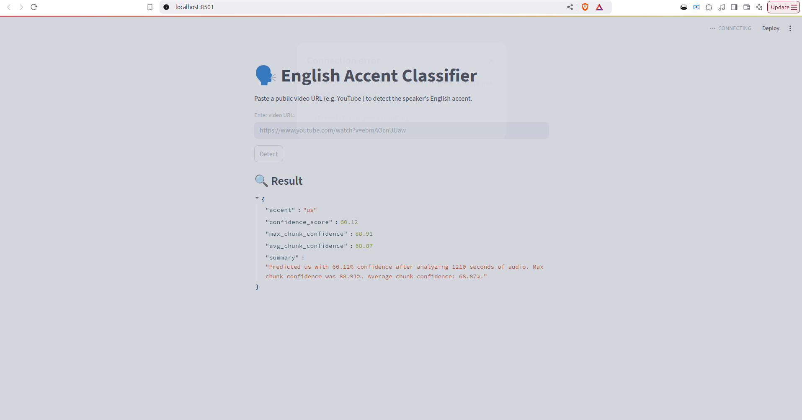
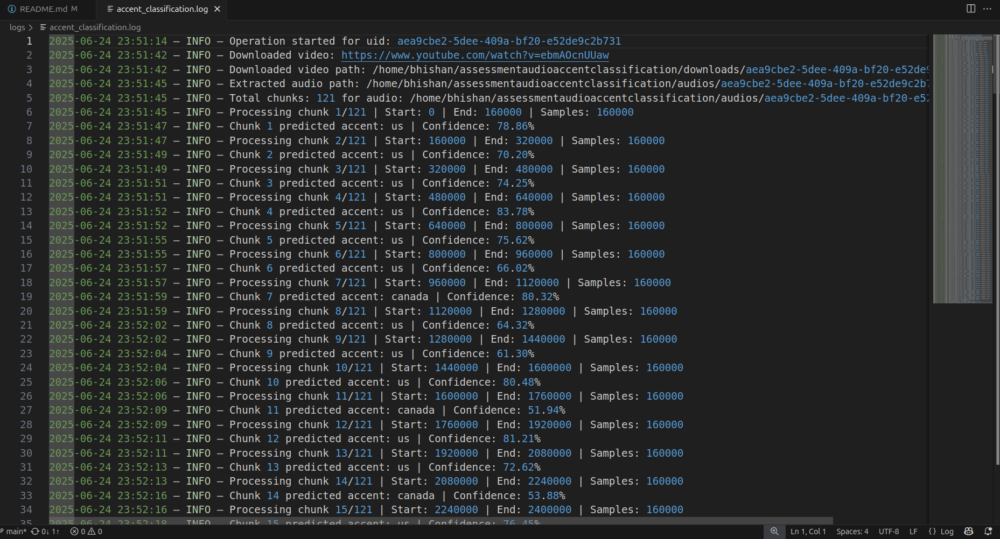

# 🗣️ English Accent Classifier from Video URL

I am using **Streamlit web app** for the UI simplicity. The app can detect the **English accent** of a speaker from a **public video URL** (such as YouTube). The solution uses **transformer-based models** (like Wav2Vec2) from Hugging Face to classify accents, and supports flexible model/feature extractor replacement.

---

## 🚀 Features

- 🎥 Accepts public video URLs: YouTube, Loom, direct `.mp4` links, etc.
- 🧠 Uses a pretrained Hugging Face model to classify English accents. Plug and play architecture. 
- 🔊 Automatically downloads the video and extracts audio using `yt-dlp` and `ffmpeg`. I am using `imageio_ffmpeg` to avoid having to install dependency outside of the python virtual environment.
- ⏱️ Splits audio into chunks and processes chunks of audio for classification. Chunk size can be determined as required. Meta-data driven architecture. 
- 📈 Returns the predicted accent, an aggregated average confidence score, highest confidence score achieved and a short summary.
- ⚙️ Easily replace the model/feature extractor to support other use cases.

---

## 🖥️ Supported Accents (Default Model)

Using `dima806/english_accents_classification`, this app can classify into:

- 🇺🇸 American (US)
- 🇬🇧 British (England)
- 🇮🇳 Indian
- 🇦🇺 Australian
- 🇨🇦 Canadian

You can switch to any Hugging Face-compatible model for different tasks or labels.

---

## 📦 Installation

### 1. Clone the repository

```bash
git clone https://github.com/yourusername/accent-classifier.git
cd audioaccentclassification
python3 -m venv venv
source venv/bin/activate  # On Windows: venv\Scripts\activate
pip install -r requirements.txt
streamlit run app.py
```

## Directory Structure
```bash
.
├── app.py
├── requirements.txt
├── logs/
│   └── accent_classification.log
├── downloads/       # temporary videos
├── audios/          # extracted audio files
├── processed/       # successfully handled media
├── failed/          # errored videos/audio
```

## Design Rationale

✅ 16 kHz Sample Rate
Wav2Vec2 and similar transformer models are pretrained on 16kHz mono audio for optimal accuracy. Therefore, I am using 16kHz in the project.

✅ Chunk-Based Classification
Instead of processing the entire file at once, I am using sliding window technique with a window size of 10(can be changed easily) so that we have an aggregated classification as well as time-window classification to make it more robust

✅ Pluggable Architecture
You can swap with any compatible huggingface models:

The model (Wav2Vec2ForSequenceClassification)

The extractor (Wav2Vec2FeatureExtractor)

The label map ({0: "us", 1: "england", ...})


✅ UUID based identification
I am using uuid to distinguish individual videos processed

✅ Structured Folder Output
Keeps things organized.

Makes debugging, automation, or retrying failed cases easier.

UUID is used for filenames to avoid collisions and allow batch-safe processing.

✅ Logging
A single log file is used for all runs:
Info level and warning logs can be found here. This can be used for debugging purposes as well as understanding the sequence of operations. 
The log file is as follows:
logs/accent_classification.log
It records downloads, audio extraction, inference results, and errors.


## Example Run Output


## Example Log
